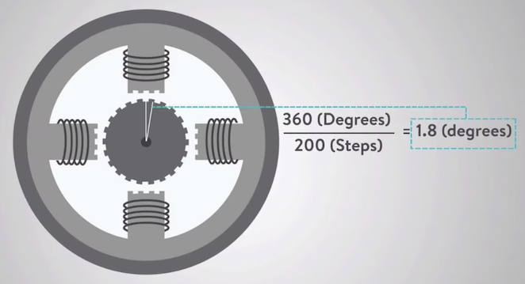

import Latex from '../../../../components/Latex.astro'

# Stepper Motors

## Steps per revolution
Number of steps the motor takes to complete one revolution

* 200 for 1.8°
* 400 for 0.9°

## Microsteps
Number of microsteps your driver is configured to use per full step.

## mm per revolution
### For a leadscrew or ballscrew system

<Latex formula='\text{mm\_per\_revolution} = \text{lead of the screw (in mm)}'/>

### For a belt-driven system
<Latex formula='\text{mm\_per\_revolution} = \text{belt pitch (mm)} \times \text{number of teeth on pulley}'/>

#### Sample
Pulley: 2GT-20T

mm_per_revolution = 2mm × 20 = 40mm

## Steps per mm
The formula to calculate `steps_per_mm` is:

<Latex formula='\text{steps\_per\_mm} = \frac{\text{steps\_per\_revolution} \times \text{microsteps}}{\text{mm\_per\_revolution}}'/>

#### Samples
<Latex formula='\text{5} = \frac{\text{200} \times \text{1}}{\text{40  }}'/>

 

<Latex formula='\text{800} = \frac{\text{200} \times \text{160}}{\text{40  }}'/>

## TB6600 Microstepping Settings
The TB6600 stepper driver supports various microstepping settings controlled by three DIP switches (SW1, SW2, and SW3). Below is a table showing the switch configurations and the corresponding microstepping modes:

| Microstep Setting     | SW1 | SW2 | SW3 | Steps per Revolution (for a 200-step motor) |
|-----------------------|-----|-----|-----|---------------------------------------------|
| Full Step (1)         | OFF | OFF | OFF | 200                                         |
| Half Step (1/2)       | ON  | OFF | OFF | 400                                         |
| Quarter Step (1/4)    | OFF | ON  | OFF | 800                                         |
| Eighth Step (1/8)     | ON  | ON  | OFF | 1600                                        |
| Sixteenth Step (1/16) | OFF | OFF | ON  | 3200                                        |
| Thirty-second Step (1/32) | ON  | OFF | ON  | 6400                                    |

