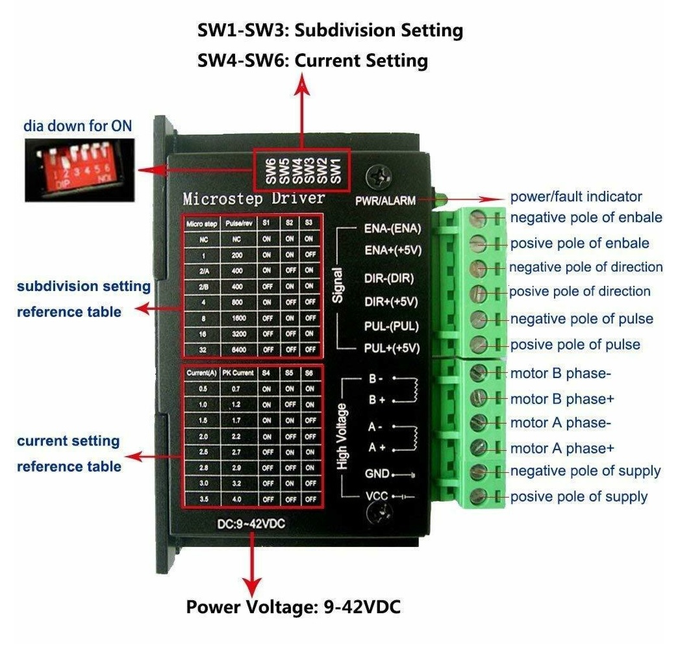

# Stepper Drive

## TB6600 Microstepping Settings

The TB6600 stepper driver supports various microstepping settings controlled by three DIP switches (SW1, SW2, and SW3). Below is a table showing the switch configurations and the corresponding microstepping modes:

## TB6600 Microstepping Settings

The TB6600 stepper driver supports various microstepping settings controlled by three DIP switches (SW1, SW2, and SW3). Below is a table showing the switch configurations and the corresponding microstepping modes:

| Microstep Setting     | SW1 | SW2 | SW3 | Steps per Revolution (for a 200-step motor) |
|-----------------------|-----|-----|-----|---------------------------------------------|
| NC                    | OFF | OFF | OFF | -                                           |
| Full Step (1)         | ON  | OFF | OFF | 200                                         |
| Half Step 2/A (1/2)   | OFF | ON  | OFF | 400                                         |
| Half Step 2/B (1/2)   | ON  | ON  | OFF | 400                                         |
| Quarter Step (1/4)    | OFF | OFF | ON  | 800                                         |
| Eighth Step (1/8)     | ON  | OFF | ON  | 1600                                        |
| Sixteenth Step (1/16) | OFF | ON  | ON  | 3200                                        |
| Thirty-second Step (1/32) | ON | ON | ON | 6400                                      |

__NC (No Connection):__ This might represent a state where no microstepping is applied or the driver is in an idle mode; "NC" does not typically correspond to a valid microstepping mode for motor operation, so the steps per revolution is listed as "-" to indicate it does not apply.

__Half Step (1/2):__ The settings "2/A" and "2/B" both represent the half-step mode but may differ based on internal driver behavior or control modes, even though they result in the same effective microstepping resolution.