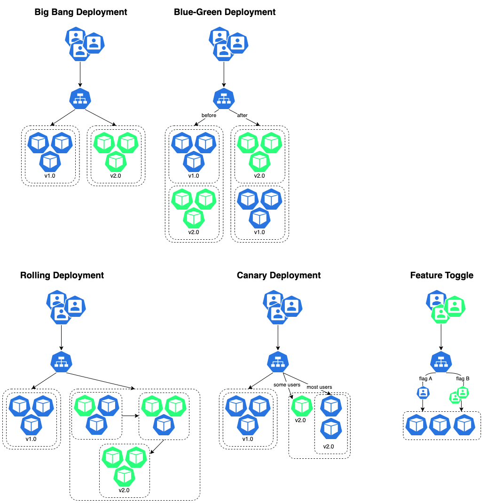

# Deployment

## Strategy

# Quick deploy and expose
Create a deployment with a service and a pod, and then expose the pod on the node
```sh
kubectl create deployment nginx-skobba --image=nginx --port=80

kubectl expose pod nginx-skobba-xxxxxxx --type NodePort --port 80
```

## Deployment Strategies
Ref.: [https://medium.com/@vinodvamanbhat/mastering-deployment-strategies-ensuring-smooth-application-rollouts-e9fefe1092b8](https://medium.com/@vinodvamanbhat/mastering-deployment-strategies-ensuring-smooth-application-rollouts-e9fefe1092b8)



### Big Bang Deployment
An all-at-once approach. It means the new software version is made live simultaneously, replacing the older version. While this approach can be simple, it also carries risks. If there's a problem, the entire system can be affected.

### Blue-Green Deployment
Two separate environments – the "blue" environment, which hosts the current version of your application, and the "green" environment, which hosts the new version. When it's time to release a new update, you switch traffic from blue to green, making the new version live.

### Canary Deployment
Releasing a new version to a small subset of users or a “canary group.” This approach helps identify and address issues before a full rollout.
* Create a new-deployment
* Reduce the replicas on the old-deployment

### Rolling Deployment
Release the new version incrementally to a subset of your infrastructure. You gradually move from one part of your infrastructure to another until the new version is deployed everywhere.

### Feature Toggle
Release the new version incrementally to a subset of your infrastructure. You gradually move from one part of your infrastructure to another until the new version is deployed everywhere.

## Basic nginx deployment
```
kubectl create deployment nginx-demo2 --image=nginx --port=80
```

## Nginx deployment labels
Unlike names and UIDs, labels do not provide uniqueness. In general, we expect many objects to carry the same label(s).

Via a label selector, the client/user can identify a set of objects. The label selector is the core grouping primitive in Kubernetes.

Create nginx sample from stdin
```
cat <<EOF | kubectl apply -f -
apiVersion: apps/v1
kind: Deployment
metadata:
  labels:
    app: nginx
  name: nginx-demo-deployment
spec:
  replicas: 1
  selector:
    matchLabels:
      app: nginx
  template:
    metadata:
      labels:
        app: nginx
    spec:
      containers:
      - image: nginx
        name: nginx-demo-container
EOF
```

## Check Resource Limits
```sh
kubectl get deployments --all-namespaces -o custom-columns=NAMESPACE:.metadata.namespace,NAME:.metadata.name,CPU_REQUEST:.spec.template.spec.containers[*].resources.requests.cpu,MEM_REQUEST:.spec.template.spec.containers[*].resources.requests.memory,CPU_LIMIT:.spec.template.spec.containers[*].resources.limits.cpu,MEM_LIMIT:.spec.template.spec.containers[*].resources.limits.memory
```
