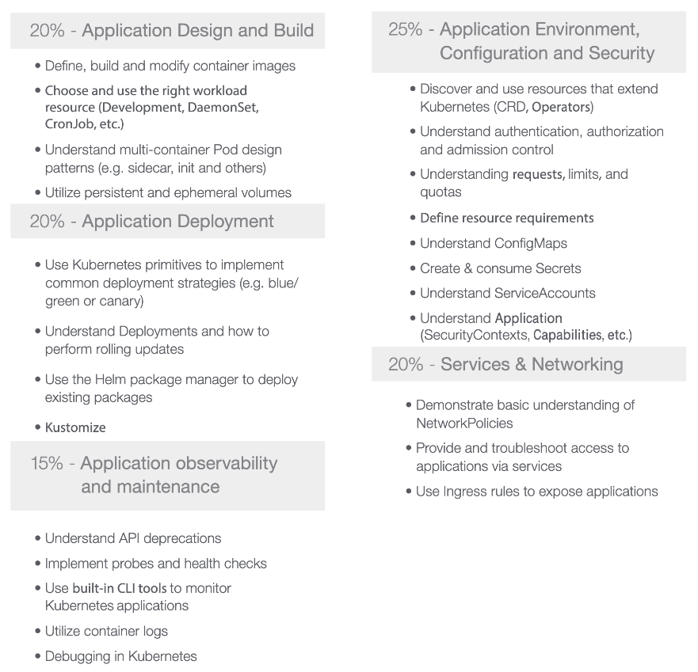

# Certifications

## CKAD - Certified Kubernetes Application Developer

### Curriculum

### What´s on the exam
* Core Concepts: API primitives & basic Pods - 13%
* Configuration: resource requests & limits, SecurityContexts, ConfigMaps, Secrets, ServiceAccounts - 18%
* Multi-Container Pods: ambassador, adapter, and sidecar patterns - 10%
* Observability: liveness & readiness probes, logging, monitoring - 18%
* Pod Design: rollouts & rollbacks, Jobs & CronJobs, metadata (labels, selectors, annotations) - 20%
* Services & Networking: Service configs, NetworkPolicies - 1
* State Persistence: PersistentVolumeClaims - 8%
